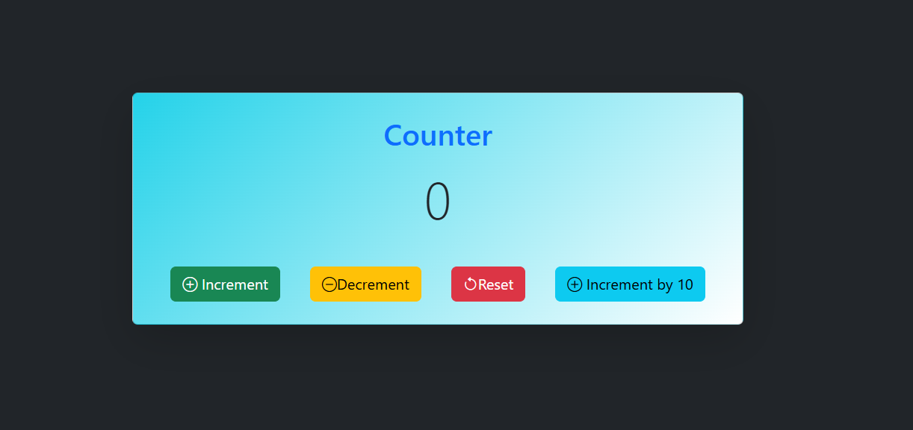

# Redux Counter App

A simple **Redux counter application** built with Redux Toolkit to practice state management.

## 📸 Preview

Below is a preview of the Redux Counter application UI:



## 🚀 Features
- Increment counter
- Decrement counter
- Reset counter
- Increment counter by a custom value using `action.payload`

## 🛠️ Technologies
- React
- Redux Toolkit
- JavaScript (ES6)
- CSS

## 🎯 Purpose
This project demonstrates core Redux concepts:
- Store configuration
- Slice creation
- Reducers
- Dispatching actions with `action.payload`
- useSelector & useDispatch hooks

## 🧠 Redux Logic Example
The counter value is increased dynamically using an action payload:

```js
incrementByValue: (state, action) => {
  state.value += action.payload;
}
